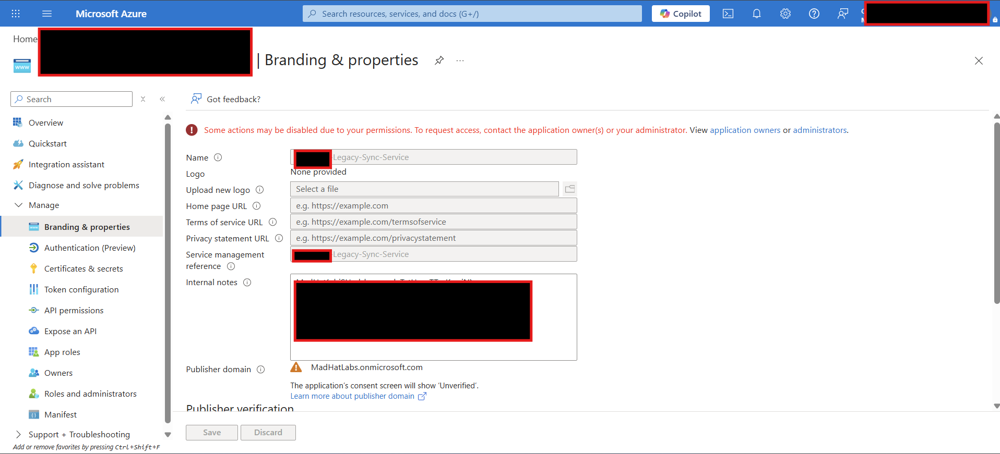
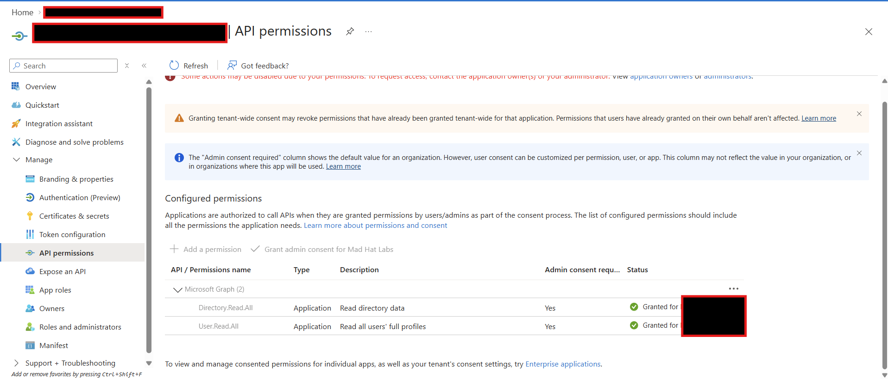
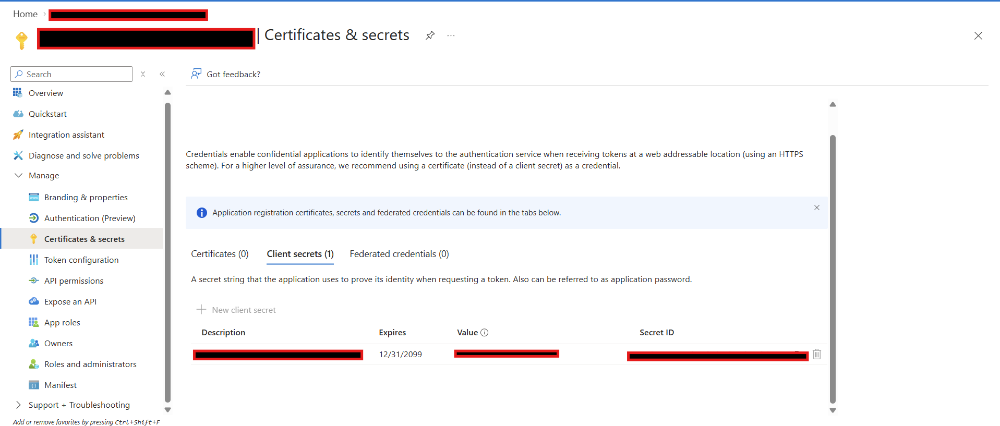
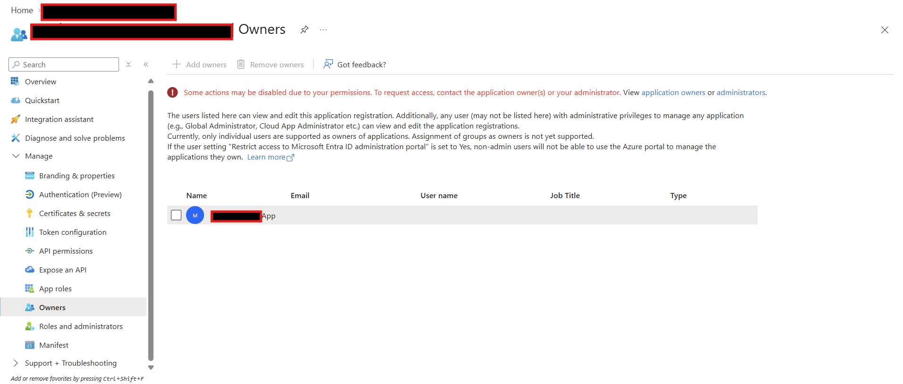
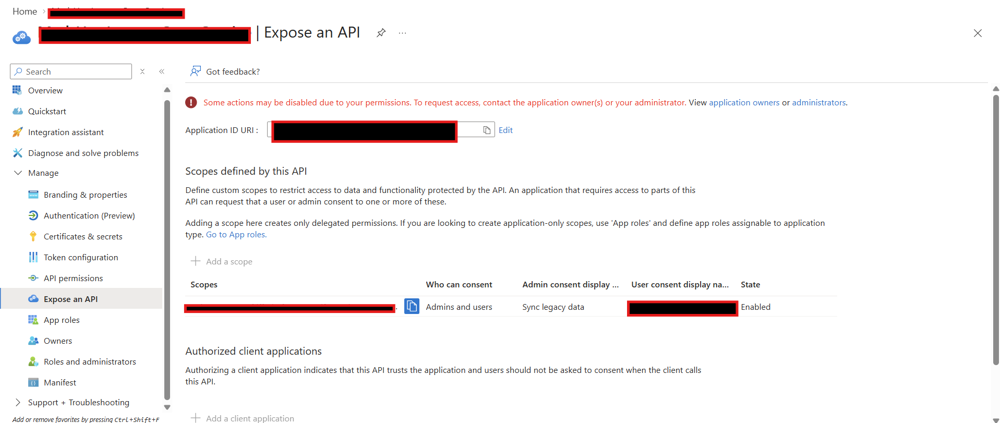

## The Stolen Identity - App registration attack kill chain (Entra ID)

## Scenario
Reconstructed a five-stage OAuth consent-phishing kill chain in a live Azure tenant through forensic analysis of two linked app registrations.
## Summary
In the last 24 hours someone got access into the client's tenant, no zero day, no detection or alerts, just exploiting the identity plane. I've been task with finding out how they did it and reconstructing the steps they used.

Carl from Accounting enter his credentials of a fake login page and completed a MFA. The attacker stole that session token that was established after MFA was satisfied, so the token carries an MFA-satisfied claim to bypass Conditional Access Policies, which was why the alarms didn't trip. Carl happened to be left as a owner on a legacy app.
The attacker used the owner rights of that legacy app to create a new client secret, authenticate as the application's service principle, getting access to MS Graph application permissions of the legacy app. They created another app, made the service principal of that 2nd app, Owner of the legacy app, created a custom API scope for peristance, and configured a redirect URL to the attacker's-controlled infrastructure to collect more session tokens from other potential users in the tenant.

The kill chain in 5 stages:
**Entry → Escalate → Pivot → Persist → Loot**

## Environment
live multi-user Azure training tenant, Reader access.

## Investigation

 1. ENTRY. Carl was phished, completed MFA, and had the resulting session token stolen. That token carried an MFA-satisfied claim and got past Conditional Access. So I first checked the legacy app's **Branding & Properties** for internal notes for context. Every app registration carries an internal notes, here I discovered the context establishing Carl's ownership of the legacy app.

*Note: Names, financial values, and proprietary data have been altered to protect client confidentiality.*

 3. ESCALATE. Using those Owner rights, the attacker created a new client secret on the legacy app. That secret let them authenticate through the client credentials flow as the service principal itself, inheriting the app's directory permissions without ever signing in as a human again.
Under API permissions, I found live Microsoft Graph application permissions with admin consent, including `Directory.Read.All` and `User.Read.All.` Application permissions let the app act as itself; no human user participates in the client-credentials flow.
Under **Certificates & secrets**, I found the attacker's new client secret. Its expiration date was set in 2099. With that credential, the attacker could authenticate programmatically as the service principal and request app-only tokens without repeatedly signing in as the victim.

 4. PIVOT. I looked at the **Owners** list of the legacy application and found the service principal of attacker's created app. If his secret was rotated he would have lost access using the client's credentials, so the attacker must have some understanding of rotation policies. To maintain access he pivoted the ownership of the legacy app to the service principal of his created app, so he can use another credential to get back in. Since default users can register their own app by default that policy should be reviewed to prevent circumstances that lead to this breach.

 6. PERSIST. I looked the **Expose an API** blade of the legacy application. What i found was the attacker had created a custom delegated scope. Confirming my suspicion of the attacker anticipating the secret and password rotation policies in place. The **Expose an API** configuration tells Entra that the legacy app can operate as the secured backend resource that other applications may request permission to call. The attacker had already created the other application. The scope created a second authorization path and now the attackers app can request delegated access to the legacy application's backend through OAuth consent flow. The risk is critical if the backend accepts the delegated request and then uses its own higher privilege without correctly checking the caller, user, tenant, scope, and requested action. The attacker was building a backup plan: if the app-only credential was discovered, the rogue application could launch a consent-phishing campaign against another signed-in employee.
 

 8. LOOT. Finally, a redirect URI on the rogue app pointing at attacker-controlled infrastructure. Combining the rogue app's client ID, that redirect URI, and the exposed API scope produces a working phishing URL. A victim who is already signed in on a corporate device clicks Accept on a consent prompt, and the authorization code lands on the attacker's server.

 ## Why the normal playbook misses it
Ordinary credential phishing runs into device compliance, location rules, and MFA. Consent phishing sidesteps all of it, because the victim is already authenticated on a trusted device. And the resulting OAuth2PermissionGrant is not removed by a password reset, not removed by revoking sessions, and not removed by enforcing MFA. Most standard containment playbooks leaves it in place.

## Attack Chain Summary
| Stage | Objective | Action |
|---------|---------|---------|
| 1 | Entry | OAuth consent phishing captured Carl's access token |
| 2 | Escalate | New client secret added to Legacy Application |
| 3 | Pivot | Rogue service principal added as owner |
| 4 | Persist | Custom API scope published |
| 5 | Loot | Redirect URIs configured for future phishing |

## Confused Deputy Attack
This attack follows the confused-deputy pattern.

The legacy connector is the deputy: a trusted application with legitimate authority. The rogue app is the caller. If the legacy backend accepts the delegated request and then performs a higher-privilege operation using its own application permissions without properly enforcing the authorization boundary, the attacker has persuaded a trusted service to exercise power on behalf of someone who should not possess it.

The deputy is not malicious. It is confused. Unfortunately, the directory does not award points for good intentions.

## What broke / what surprised me
The long-lived secret was obvious. The ownership path was clever. A standard user's owner assignment was exploited by the attack not by impersonation or operating as the user; but by creating a second service principal to preserve that control. Ill have to keep this scenario in mind when doing audits and reviews, as this changes how i think about identity and access. Password reset, session revocation, and MFA enforcement sound decisive because they are decisive against a narrow class of problems. They do not erase application consent. You also have to ask what they own, what owns what, which credentials those objects trust, and which permissions have already been granted. The grant sits in the directory, perfectly valid and entirely indifferent to the confidence with which someone closes the incident ticket.

## Findings and recommendations
- Revoke the client secret
- Remove the rogue service principal from Owners 
- Delete the custom exposed API scope 
- Revoke the OAuth2PermissionGrant explicitly, because containment does not remove it 
- Remove the attacker redirect URI 
- Review and reduce the Graph application permissions 
- Disable default user app registration 
- Audit every app registration's Owners list the same way you audit directory role membership 
- Alert on new client secrets and new redirect URIs.
  
## What I learned
- How OAuth side steps security controls
- Password changes, revoking sign-in sessions, MFA does not delete the grant.
- OAuth can be exploited via the Confused Deputy
- Default user app registration is crazy risky, that's something ill be reviewing in my audits.
- Owning an application is basically an unlogged privelege path.
- All this started from a basic phishing webpage, awareness training helps prevent this type of breach
